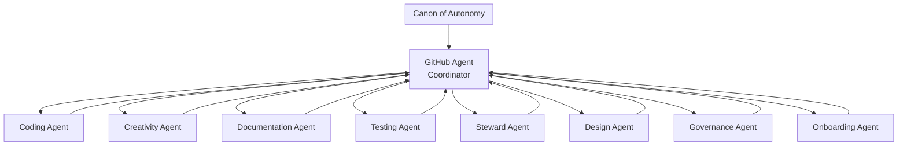

# Agent Ecosystem Overview

**Autonomous Collaboration Framework for Quantum Resonance Clean**

## Introduction

The Quantum Resonance Clean repository operates with an **autonomous agent ecosystem**—a network of specialized AI agents that collaborate to maintain code quality, documentation, security, and repository health. This system enables self-sustaining development while preserving human authority and contributor autonomy.

At the center of this ecosystem is the **GitHub Agent**, which serves as the coordinator and router, ensuring all work flows smoothly between specialized agents while maintaining adherence to the Canon of Autonomy.

**For complete GitHub Agent documentation, see: [`GITHUB_AGENT_INSTRUCTIONS.md`](../GITHUB_AGENT_INSTRUCTIONS.md)**

## Core Philosophy

> **Agents are collaborators, not replacements.**

Agents augment human capability by:
- Automating routine maintenance tasks
- Providing specialized expertise on-demand
- Maintaining consistency across the codebase
- Enabling rapid iteration with safety checks

## Agent Network

### Visual Architecture with GitHub Agent Coordinator



### Legacy ASCII Architecture

```
┌─────────────────────────────────────────────────────────────────┐
│                    CANON OF AUTONOMY                            │
│         (Root Governance - Defines Principles & Boundaries)     │
└─────────────────────────────────────────────────────────────────┘
                                │
                     ┌──────────┴───────────┐
                     │                      │
                     ▼                      ▼
            GitHub Agent              Core Agents
             (Coordinator)                 │
                     │          ┌───────────┼───────────┐
                     │          │           │           │
                     └──────────┼───────────┼───────────┼────┐
                                ▼           ▼           ▼    │
                           ┌────────┐  ┌────────┐  ┌────────┐│
                           │ CODING │◄─┤ TESTING│◄─┤  DOCS  ││
                           └────────┘  └────────┘  └────────┘│
                                ▲           ▲           ▲     │
                                │           │           │     │
                                └───────────┼───────────┘     │
                                            │                 │
                                ┌───────────┼─────────────────┘
                                │           │           
                                ▼           ▼           
                           ┌────────┐  ┌────────┐  
                           │CREATIVE│  │ DESIGN │  
                           └────────┘  └────────┘  
                                ▲           ▲       
                                │           │       
                                └─────┬─────┘       
                                      │             
                            ┌─────────┴─────────┐   
                            │                   │   
                            ▼                   ▼   
                       ┌────────┐        ┌──────────┐
                       │STEWARD │        │ONBOARDING│
                       └────────┘        └──────────┘
                            ▲                   ▲
                            │                   │
                            └─────────┬─────────┘
                                      │
                                      ▼
                                ┌──────────┐
                                │GOVERNANCE│
                                └──────────┘
```

### Agent Collaboration Flows

```
┌─────────────────────────────────────────────────────────────┐
│  Example: New Feature Implementation                        │
└─────────────────────────────────────────────────────────────┘

Contributor Request
        │
        ▼
   ONBOARDING AGENT ──────► Understands requirements
        │                   Routes to appropriate agent
        ▼
   CODING AGENT ──────────► Implements feature
        │                   Follows existing patterns
        │                   Documents decisions
        ▼
   TESTING AGENT ─────────► Creates test suite
        │                   Validates functionality
        │                   Checks coverage
        ▼
   DOCUMENTATION AGENT ───► Updates docs
        │                   Adds API examples
        │                   Updates README
        ▼
   STEWARD AGENT ─────────► Reviews for consistency
        │                   Checks technical debt
        │                   Validates patterns
        ▼
   Contributor Approval ──► Merge & Deploy
```

## The Agent Ecosystem

### 0. 🧭 GitHub Agent (Coordinator)
**Purpose:** Central coordinator and router for all agent work

**Specialties:**
- Task routing to appropriate specialist agents
- Canon of Autonomy alignment verification
- Clean handoff facilitation between agents
- Transparency and documentation maintenance
- System health monitoring and coordination

**Handoff to:** Any specialist agent based on task requirements

**Common Scenarios:**
- Routing complex tasks to multiple agents
- Coordinating large features or refactors
- Ensuring Canon compliance
- Facilitating agent collaboration

📄 **[Full Instructions](../GITHUB_AGENT_INSTRUCTIONS.md)**

---

### 1. 🧑‍💻 Coding Agent
**Purpose:** Code implementation, refactoring, and technical problem-solving

**Specialties:**
- Writing clean, maintainable code
- Bug fixing and debugging
- Code refactoring and optimization
- Pattern recognition and consistency
- Technical architecture decisions

**Handoff to:** Testing Agent for validation, Documentation Agent for technical docs

**Common Scenarios:**
- Implementing new features or endpoints
- Fixing bugs reported in issues
- Refactoring legacy code
- Optimizing performance bottlenecks

📄 **[Full Instructions](./CODING_AGENT.md)**

---

### 2. 🧪 Testing Agent
**Purpose:** Test generation, validation, and quality assurance

**Specialties:**
- Unit and integration test creation
- Test coverage analysis
- CI/CD pipeline configuration
- Performance and load testing
- Test pattern consistency

**Handoff to:** Documentation Agent for test documentation, Coding Agent if bugs found

**Common Scenarios:**
- Creating tests for new features
- Improving test coverage
- Setting up automated testing
- Debugging test failures

📄 **[Full Instructions](./TESTING_AGENT.md)**

---

### 3. 📚 Documentation Agent
**Purpose:** Technical documentation and knowledge management

**Specialties:**
- API documentation generation
- README and guide creation
- Code comment standards
- Tutorial and example creation
- Documentation site maintenance

**Handoff to:** Steward Agent for review, Onboarding Agent for contributor guides

**Common Scenarios:**
- Documenting new APIs
- Updating setup instructions
- Creating usage examples
- Maintaining changelog

📄 **[Full Instructions](./DOCUMENTATION_AGENT.md)**

---

### 4. 🎨 Creativity Agent
**Purpose:** Innovation, design exploration, and user experience optimization

**Specialties:**
- UI/UX brainstorming
- Naming conventions
- Visual design concepts
- User journey optimization
- Feature ideation

**Handoff to:** Design Agent for implementation, Coding Agent for technical feasibility

**Common Scenarios:**
- Exploring new feature ideas
- Improving user workflows
- Naming new components
- Visual asset recommendations

📄 **[Full Instructions](./CREATIVITY_AGENT.md)**

---

### 5. 🎭 Design Agent
**Purpose:** Design system implementation and visual consistency

**Specialties:**
- Component library development
- Design system maintenance
- Accessibility compliance (WCAG)
- Visual consistency enforcement
- Responsive design implementation

**Handoff to:** Coding Agent for technical implementation, Testing Agent for accessibility testing

**Common Scenarios:**
- Building reusable components
- Ensuring accessibility standards
- Implementing design mockups
- Maintaining visual consistency

📄 **[Full Instructions](./DESIGN_AGENT.md)**

---

### 6. 🛡️ Steward Agent
**Purpose:** Repository health monitoring and maintenance

**Specialties:**
- Code quality monitoring
- Technical debt tracking
- Pattern consistency validation
- Contribution review
- Repository cleanup

**Handoff to:** Governance Agent for policy issues, specific agents for remediation

**Common Scenarios:**
- Reviewing pull requests
- Identifying technical debt
- Monitoring repository health
- Coordinating large refactors

📄 **[Full Instructions](./STEWARD_AGENT.md)**

---

### 7. ⚖️ Governance Agent
**Purpose:** Policy enforcement and community standards

**Specialties:**
- Ethical guideline maintenance
- Policy enforcement
- Conflict resolution
- Community standards
- Canon alignment verification

**Handoff to:** Steward Agent for implementation, Onboarding Agent for education

**Common Scenarios:**
- Updating contribution guidelines
- Resolving conflicts
- Enforcing code of conduct
- Maintaining Canon compliance

📄 **[Full Instructions](./GOVERNANCE_AGENT.md)**

---

### 8. 🎓 Onboarding Agent
**Purpose:** New contributor guidance and learning facilitation

**Specialties:**
- Setup instructions
- Contribution workflow guidance
- Learning path curation
- First-time contributor support
- Routing to specialized agents

**Handoff to:** Appropriate specialist agent based on contributor needs

**Common Scenarios:**
- Helping new contributors get started
- Explaining project architecture
- Guiding through first contribution
- Troubleshooting setup issues

📄 **[Full Instructions](./ONBOARDING_AGENT.md)**

---

## Agent Selection Guide

### Decision Tree: Which Agent Do I Need?

```
Start Here: What do you need help with?
│
├─ Not sure which agent or complex coordination needed
│  └─► GITHUB AGENT (Coordinator)
│
├─ Code implementation or bug fix
│  └─► CODING AGENT
│
├─ Writing or running tests
│  └─► TESTING AGENT
│
├─ Documentation or examples
│  └─► DOCUMENTATION AGENT
│
├─ Design concept or UX improvement
│  └─► CREATIVITY AGENT → DESIGN AGENT
│
├─ UI component or accessibility
│  └─► DESIGN AGENT
│
├─ Repository health or PR review
│  └─► STEWARD AGENT
│
├─ Policy question or conflict
│  └─► GOVERNANCE AGENT
│
└─ Getting started or general questions
   └─► ONBOARDING AGENT
```

### Quick Reference Table

| Task | Primary Agent | Secondary Agent |
|------|---------------|-----------------|
| Complex multi-agent coordination | GitHub Agent | Various |
| Route unclear tasks | GitHub Agent | → Specialist |
|------|---------------|-----------------|
| Implement new API endpoint | Coding | Testing |
| Fix failing test | Testing | Coding |
| Write API documentation | Documentation | Testing |
| Design new component | Creativity → Design | Coding |
| Improve accessibility | Design | Testing |
| Review pull request | Steward | Governance |
| Update contribution guide | Documentation | Onboarding |
| Resolve merge conflict | Coding | Steward |
| Plan new feature | Creativity | Coding |
| Setup development environment | Onboarding | Coding |

## Working with Agents

### Invoking an Agent

**In GitHub Issues or Pull Requests:**
```
@agent [agent-name] [request]

Example:
@agent coding-agent Please implement JWT authentication for the resonance API
@agent testing-agent Add integration tests for the new authentication flow
```

**In Copilot Chat:**
```
I need help from the [Agent Name] agent to [specific task]

Example:
I need help from the Coding Agent to refactor the quantum resonance calculations
```

### What to Expect

**Agents will:**
- ✅ Explain their approach before implementing
- ✅ Follow existing code patterns
- ✅ Ask clarifying questions when needed
- ✅ Provide proper handoffs with context
- ✅ Document their decisions
- ✅ Test their changes

**Agents will NOT:**
- ❌ Make decisions without contributor input
- ❌ Override your preferences
- ❌ Merge or deploy without approval
- ❌ Break existing functionality
- ❌ Skip testing or documentation

## Common Collaboration Patterns

### Pattern 1: Feature Development
1. **Onboarding Agent** - Clarifies requirements
2. **Creativity Agent** - Explores design options
3. **Coding Agent** - Implements functionality
4. **Testing Agent** - Validates implementation
5. **Documentation Agent** - Creates docs
6. **Steward Agent** - Reviews for consistency

### Pattern 2: Bug Fix
1. **Coding Agent** - Diagnoses and fixes issue
2. **Testing Agent** - Creates regression tests
3. **Steward Agent** - Reviews impact
4. **Documentation Agent** - Updates if needed

### Pattern 3: Refactoring
1. **Steward Agent** - Identifies technical debt
2. **Coding Agent** - Performs refactoring
3. **Testing Agent** - Ensures no regressions
4. **Documentation Agent** - Updates architecture docs

### Pattern 4: Design System Work
1. **Creativity Agent** - Proposes design concepts
2. **Design Agent** - Creates components
3. **Coding Agent** - Implements in application
4. **Testing Agent** - Tests accessibility
5. **Documentation Agent** - Creates component docs

## Handoff Protocol

All agents follow the standardized **[Handoff Protocol](./HANDOFF_PROTOCOL.md)** which ensures:
- Complete context transfer
- Clear next steps
- Risk documentation
- Testing status

When receiving a handoff, you'll get:
1. **Work Summary** - What was done
2. **Affected Files** - What changed
3. **Context** - Why decisions were made
4. **Risks** - What to watch out for
5. **Next Steps** - What to do next
6. **Testing Status** - What's validated

## Integration with Existing Systems

### WorkflowPatchAgent
The existing `ledger-api/src/services/workflow_patch_agent.py` demonstrates autonomous agent patterns that inspired this ecosystem:
- Automated analysis and issue detection
- Progressive deployment with rollback
- Comprehensive testing requirements
- Guardian role authentication

The agent ecosystem extends these patterns repository-wide.

### Repository Guidelines
All agents respect:
- **[CONTRIBUTING.md](../../CONTRIBUTING.md)** - Contribution guidelines
- **[SECURITY_SUMMARY.md](../../SECURITY_SUMMARY.md)** - Security practices
- **[Canon of Autonomy](../CANON_OF_AUTONOMY.md)** - Governance principles

## Getting Help

### For Contributors
- **Getting started?** → Ask the Onboarding Agent
- **Technical question?** → Check agent specialties above
- **Not sure which agent?** → Start with GitHub Agent or Onboarding Agent
- **Complex coordination needed?** → Use GitHub Agent

### For Maintainers
- **Agent misbehaving?** → Report to Governance Agent
- **New agent type needed?** → Discuss with community
- **Canon update needed?** → Submit PR with rationale

## Contributing to the Ecosystem

The agent ecosystem itself can evolve! To contribute:

1. **Propose new agents** - Submit issue with use case
2. **Improve instructions** - PR to agent markdown files
3. **Update protocols** - PR to HANDOFF_PROTOCOL.md
4. **Refine Canon** - PR to CANON_OF_AUTONOMY.md

All changes require maintainer approval and community discussion.

## Resources

- **[Canon of Autonomy](../CANON_OF_AUTONOMY.md)** - Root governance document
- **[GitHub Agent Instructions](../GITHUB_AGENT_INSTRUCTIONS.md)** - Central coordinator guide
- **[Handoff Protocol](./HANDOFF_PROTOCOL.md)** - Work transfer standards
- **[Copilot Instructions](../copilot-instructions.md)** - Technical guidance

### Individual Agent Instructions
- [GitHub Agent (Coordinator)](../GITHUB_AGENT_INSTRUCTIONS.md)
- [Coding Agent](./CODING_AGENT.md)
- [Testing Agent](./TESTING_AGENT.md)
- [Documentation Agent](./DOCUMENTATION_AGENT.md)
- [Creativity Agent](./CREATIVITY_AGENT.md)
- [Design Agent](./DESIGN_AGENT.md)
- [Steward Agent](./STEWARD_AGENT.md)
- [Governance Agent](./GOVERNANCE_AGENT.md)
- [Onboarding Agent](./ONBOARDING_AGENT.md)

## Version History

| Version | Date | Changes |
|---------|------|---------|
| 1.0 | 2025-12-19 | Initial agent ecosystem implementation |
| 1.1 | 2025-12-27 | Added GitHub Agent coordinator |

---

**Maintained by:** Quantum Resonance Clean Community  
**Status:** Active  
**Last Updated:** 2025-12-27
